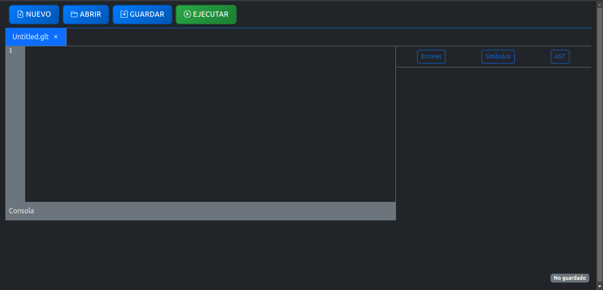
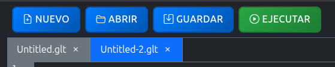
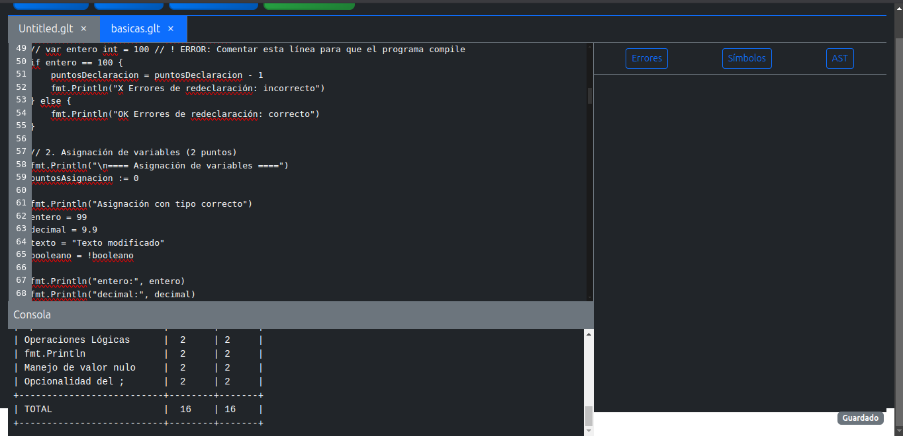
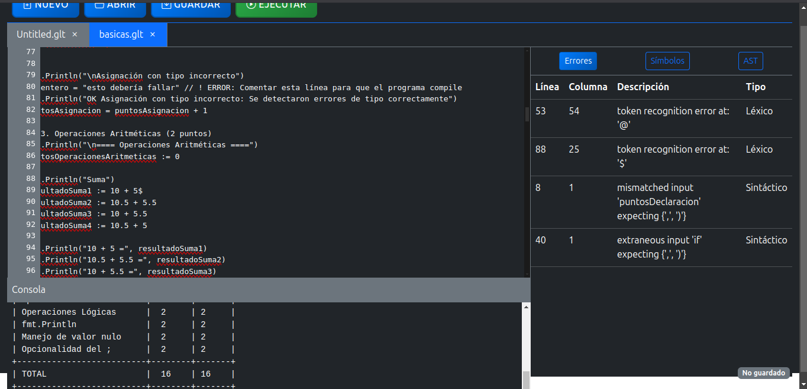
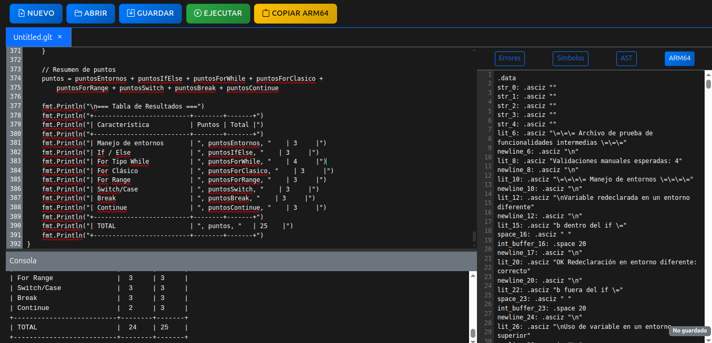
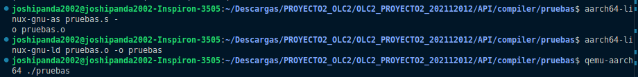
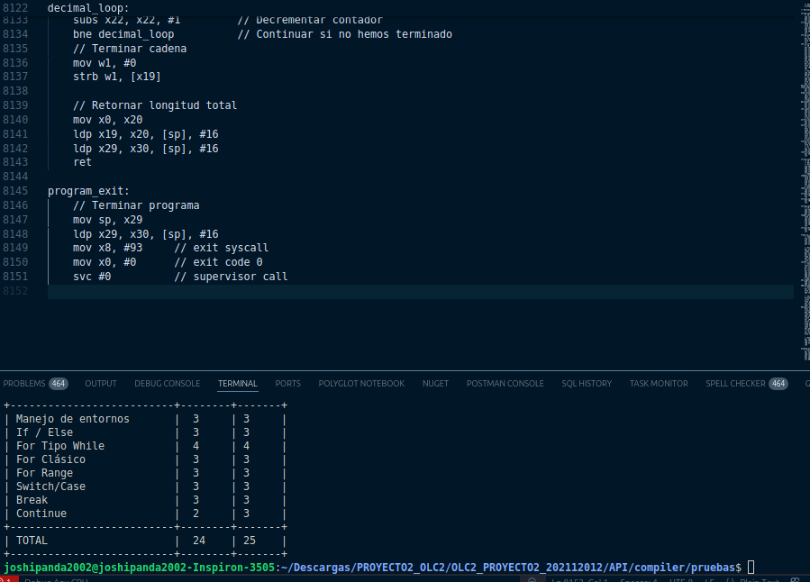

# 📌 Universidad de San Carlos de Guatemala  
### 🏛 Facultad de Ingeniería - Escuela de Ciencias y Sistemas  
### 🖥 ORGANIZACION DE LENGUAJES Y COMPILADORES 2, SECCION B

## 👤 Nombre: **Edgar Josías Cán Ajquejay**  
## 🎓 Carnet: **202112012**  

## 🏥 **Manual de Usuario**  

### EJECUTAR PROYECTO
para ejecutar el programa es necesario tener instalado lo que es ANTLR 4 en visual studio code
asi como C#

# Instalación de ANTLR4 y C# en Visual Studio Code en Ubuntu

## Instalación de Java (Requerido para ANTLR4)
ANTLR4 requiere Java para ejecutarse. Instala OpenJDK si no lo tienes:

```bash
sudo apt update
sudo apt install openjdk-17-jdk -y
```
Verifica la instalación:

```bash
java -version
```

## Instalación de ANTLR4

Descarga e instala ANTLR4:
```bash
cd /usr/local/lib
sudo curl -O https://www.antlr.org/download/antlr-4.13.1-complete.jar

Configura las variables de entorno:

echo 'export CLASSPATH=".:/usr/local/lib/antlr-4.13.1-complete.jar:$CLASSPATH"' >> ~/.bashrc
echo 'alias antlr4="java -jar /usr/local/lib/antlr-4.13.1-complete.jar"' >> ~/.bashrc
echo 'alias grun="java org.antlr.v4.gui.TestRig"' >> ~/.bashrc
source ~/.bashrc
```

Verifica la instalación:

```bash
antlr4 -version
```

## Instalación del SDK de .NET (Requerido para C#)

El desarrollo en C# en Visual Studio Code requiere el SDK de .NET.

Instala el repositorio de paquetes de Microsoft:

```bash
wget https://packages.microsoft.com/config/ubuntu/$(lsb_release -rs)/packages-microsoft-prod.deb -O packages-microsoft-prod.deb
sudo dpkg -i packages-microsoft-prod.deb
rm packages-microsoft-prod.deb
```

Actualiza los paquetes e instala el SDK de .NET:

```bash
sudo apt update
sudo apt install -y dotnet-sdk-7.0
```

Verifica la instalación:

```bash
dotnet --version
```

## Instalación de Visual Studio Code

Si no tienes instalado VS Code, instálalo con:

```bash
sudo apt update
sudo apt install -y code
```

## Instalación de la Extensión de C# en VS Code

Abre VS Code e instala las extensiones C# Dev Kit y C# desde el Marketplace.

También puedes instalarla desde la terminal con:

```bash
code --install-extension ms-dotnettools.csharp
```

## Configuración de ANTLR4 para C# en VS Code

Dentro de tu carpeta de proyecto, crea un archivo de gramática ANTLR4:

```bash
mkdir ANTLR && cd ANTLR
touch Language.g4
```

Genera los archivos C# a partir de la gramática:

```bash
antlr4 -Dlanguage=CSharp MiGramatica.g4 -visitor -o Generados
```

## Ejecución de un Proyecto C# con ANTLR4

1. Crea un nuevo proyecto C#:

```bash
dotnet new console -n MiProyectoANTLR
cd MiProyectoANTLR
```

2. Agrega la dependencia de ANTLR4:

```bash
dotnet add package Antlr4.Runtime.Standard
```

3. Copia los archivos generados por ANTLR4 dentro del proyecto C#:

```bash
cp -r ../ANTLR/Generados/* MiProyectoANTLR/
```

4. Escribe un programa en C# que utilice el parser generado.

5. Compila y ejecuta el programa:

```bash
dotnet run
```

### INTERFAZ PRINCIPAL
Al usuario se le mostrara la interfaz principal de usuario en donde
aparecera las partes de mi interfaz en donde se muestra la consola donde
se ingresara el codigo, tambien los botones de interaccion con la interfaz
y el apartado izquierdo de los errores, tabla de simbolos y el AST.



### MENU
SE LE MUESTRAN 4 BOTONES EN DONDE CADA UNO EJECUTA UNA FUNCION EN LA INTERFAZ
- Nuevo: El usuario podra crear una nueva pestaña en donde podra ingresar el codigo a interpretar
- Abrir: Al momento de seleccionarlo se abrira el explorador de archivos del sistema en donde debera buscar el archivo
a cargar que en este caso es .glt
- Guardar: Al momento de seleccionarlo se abrira el explorador de archivos del sistema en donde debera buscar la ubicacion del archivo
a guardar en este caso lo guardara como .glt



### Abrir archivo
- Abrir: Al momento de seleccionarlo se abrira el explorador de archivos del sistema en donde debera buscar el archivo .glt
y automaticamente se abrira el archivo en la interfaz y se mostrara el codigo en consola.


### Ejecutar Interprete
- Al momento de colocar el texto del archivo en la consola puede proceder a ejecutar el codigo a traves del boton **Ejecutar** y
se procedera a ejecutar el codigo interprete mostrando su salida en consola.



### Ver errores
- Al momento de ejecutar el codigo hay un apartado derecho para ver los errores al darle clic se puede proceder a observar los
errores que tiene dicho archivo de entrada, mostrando el tipo de error y la ubicacion.



### Ver tabla de simbolos
- Asi tambien al momento de ejecutar el codigo hay un apartado derecho para ver la tabla de simbolos al darle clic se puede proceder a observar los
simbolos que tiene dicho archivo de entrada, mostrando el tipo de simbolo y la ubicacion.


### Traduccion a ARM
- Ahora al momento de ejecutar el codigo en el apartado derecho aparece la traduccion del codigo entrante a ARM64
esto con el objetivo de ejecutar el codigo en QEMU y obtener la misma salida que en consola.




### Ejecucion de ARM
- Al momento de copiar el codigo de ARM64 se puede proceder a utilizar QEMU como emulador y compilador de ARM64,
para ello se debe crear un archivo .s en donde se ingresara para ejecutar el codigo, ya en QEMU se ejecutan los comandos de la primera imagen para ensamblar y compilar el codigo y posteriormente se mostrara la salida del mismo.




